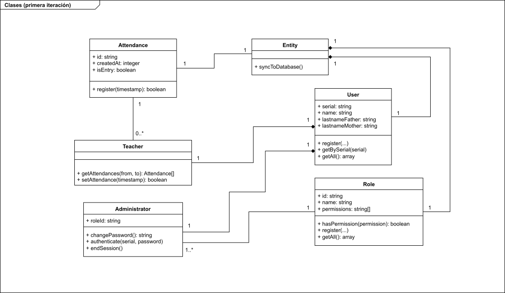

# Sistema de chequeo de entradas y salidas para personal docente

## Estructura de archivos

Todos los microservicios se encuentran dentro del directorio `modules`, cada uno
en el directorio con el nombre del módulo correspondiente.

La estructura actual del proyecto es la siguiente.

```txt
.
├── database-schema.drawio
├── modules
│   ├── authentication
│   ├── checkout
│   ├── database
│   └── frontend
├── prepare.sh
└── README.md
```

## Requisitos
- Sistema operativo basado en Unix
- Node.js >= 24
- PostgreSQL >= 18

Además del software listado previamente, se debe instalar un paquete global para
compilar TypeScript.

```bash
npm i -g typescript
```

También se requiere de PM2 para ejecutar los módulos simultáneamente.

```bash
npm i -g pm2
```

## Preparación

Primero se ejecuta el siguiente comando en el directorio raíz del proyecto
para instalar todos los paquetes necesarios de los módulos del proyecto.

```bash
sh ./prepare.sh
```

Cada módulo tiene su configuración individual, para configurarlos, se debe
duplicar el archivo `example.env` que se encuentra en cada uno de los módulos
del proyecto y renombrarlo a `.env` cambiando la configuración de cada uno.

Por ejemplo.

```bash
cd modules/database
cp example.env .env
vi .env
```

## Ejecución

Para iniciar el proyecto, ejecute el script `start.sh` desde el directorio
raíz del repositorio.

```bash
sh ./start.sh
```

Luego de eso, acceda al proyecto por medio de `http://127.0.0.1:3000/` desde
un navegador.

## Diagrama de clases

 

Las clases del diagrama se encuentran implementados en el módulo `database` en
el directorio [src/entities](modules/database/src/entities) del módulo.

## Extensiones recomendadas para Visual Studio Code

Una extensión recomendada para ejecutar pruebas con los módulos es
[REST Client](https://marketplace.visualstudio.com/items?itemName=humao.rest-client),
esta extensión sirve para realizar peticiones HTTP a cada módulo sin necesidad
de programas de terceros como Postman.

Dentro del directorio de cada ḿodulo, se encuentra un archivo `tests.http` que
se usó con dicha extensión para realizar las pruebas de funcionamiento de cada
módulo.
